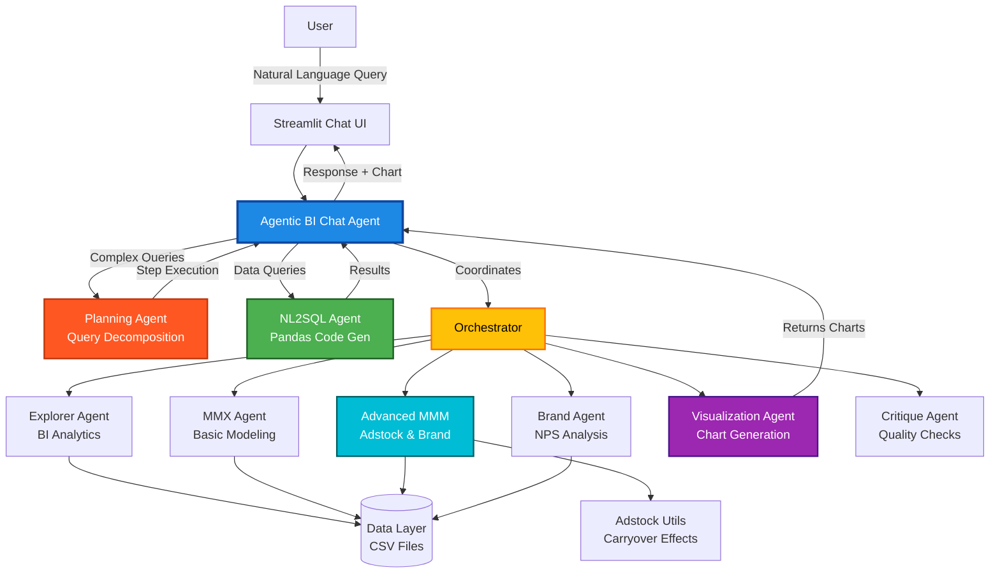

# MMX Agentic BI Assistant 🤖

An intelligent **AI-powered Marketing Mix Modeling and Business Intelligence Agent** built with a multi-agent architecture. Ask questions in natural language and get insights with dynamic visualizations.

## 🌟 Key Features

### Conversational BI Interface
- **Single Agent Interface**: No complex dashboards - just chat with the AI
- **Dynamic Visualizations**: Agent generates charts on-demand based on your questions
- **Natural Language Queries**: Ask questions like "Show me ROI decomposition" or "Which channel should I optimize?"
- **Intelligent Fallback**: Uses LLM-powered NL2SQL for any unrecognized query

### Agentic Capabilities (NEW!)
- **Planning Agent**: Breaks down complex, multi-step queries into executable plans
- **NL2SQL Agent**: Converts natural language to Pandas code for flexible data queries
- **LLM Integration**: Powered by Google Gemini for enhanced understanding

### Advanced Analytics Capabilities

#### 1. Marketing Mix Modeling (MMM)
- **Adstock Transformations**: Captures carryover effects of marketing spend
- **ROI Decomposition**: Separates immediate vs long-term returns
- **Multi-Model Comparison**: Compares 3 models (Immediate, Adstock, Full)

#### 2. Brand Equity Analysis
- **NPS Tracking**: Monitor Net Promoter Score trends
- **Brand Impact Quantification**: Measure sales lift per NPS point
- **Correlation Analysis**: Understand NPS-Sales relationships

#### 3. Business Intelligence
- **Sales Analysis**: Category breakdowns, trends, totals
- **Channel Performance**: ROI, contributions, efficiency metrics
- **Budget Optimization**: Spend mix analysis, allocation recommendations
- **Data Correlations**: Heatmaps showing channel relationships

## 🏗️ Architecture

### Multi-Agent System



### Component Details

#### **Agentic BI Chat** (`src/agents/agentic_bi_chat.py`)
- Natural language understanding
- Query routing to appropriate agents
- Response formatting with visualizations

#### **Orchestrator** (`src/agents/orchestrator.py`)
- Central coordinator for all sub-agents
- Runs analysis pipelines
- Manages state and data flow

#### **Specialized Agents**
- **Explorer Agent**: KPIs, categories, correlations
- **MMX Agent**: Basic linear regression modeling
- **Advanced MMM**: Adstock transformations, multi-model comparison
- **Brand Agent**: NPS analysis and trends
- **Visualization Agent**: Dynamic chart generation
- **Critique Agent**: Model quality evaluation

#### **Data Layer** (`src/data_loader.py`)
- Loads and cleans Kaggle dataset
- Aggregates sales by category
- Merges media spend with NPS data

#### **Utilities**
- **Adstock Utils** (`src/utils/adstock.py`): Geometric adstock transformations
- **LLM Interface** (`src/utils/llm_interface.py`): Google Gemini integration
- **Memory** (`src/utils/memory.py`): Conversational context tracking

## 🚀 Getting Started

### Prerequisites
- Python 3.8+
- Git

### Installation

1. **Clone the repository:**
   ```bash
   git clone https://github.com/AvirupRoy2195/MMX_Agent.git
   cd MMX_Agent
   ```

2. **Install dependencies:**
   ```bash
   pip install streamlit pandas scikit-learn plotly kagglehub python-dotenv google-generativeai
   ```

3. **Download data:**
   ```bash
   python download_data.py
   ```

### Running the Agent

```bash
streamlit run app.py
```

The agent will open at `http://localhost:8501`

### LLM Setup (Optional but Recommended)

To enable full Planning & NL2SQL capabilities:

1. Get a Gemini API key from [Google AI Studio](https://makersuite.google.com/app/apikey)
2. Create a `.env` file in the project root:
   ```
   GEMINI_API_KEY=your_api_key_here
   ```
3. Restart the app

## 💬 Sample Queries

### Sales Analysis
- "Show me sales by category"
- "What's the sales trend over time?"
- "Total sales"

### ROI & Performance
- "Show me ROI"
- "ROI decomposition" *(short vs long-term)*
- "Which channel has the best ROI?"

### Budget Optimization
- "Show me spend mix"
- "Channel efficiency"
- "Which channel should I optimize?"

### Brand Health
- "Show me NPS"
- "Brand analysis"
- "NPS trend"

### Model Performance
- "Compare models"
- "Model accuracy"
- "Show model performance"

### Correlations
- "Show correlations"
- "Relationship between channels"

### Flexible Data Queries (NL2SQL)
- "Show me the table rows in the data"
- "What are the column names?"
- "List all months where TV spend was above 50000"
- "Rank channels by total contribution"

### Multi-Step Queries (Planning Agent)
- "First show me sales trend, then tell me the best ROI channel"
- "Compare model performance and then summarize the feedback"

## 📊 Technical Details

### Models Implemented

1. **Immediate Effects Model**
   - Simple linear regression: `Sales = β₀ + Σ(βᵢ × Spendᵢ)`

2. **Adstock Model**
   - Includes carryover: `Sales = β₀ + Σ(βᵢ × Spendᵢ) + Σ(γᵢ × Adstock(Spendᵢ))`
   - Adstock: `Adstock[t] = Spend[t] + decay × Adstock[t-1]`

3. **Full Model**
   - Adstock + Brand Equity: `Sales = ... + β_NPS × NPS`

### Visualizations Available
- Line charts (trends)
- Bar charts (ROI, contributions)
- Stacked bar charts (ROI decomposition)
- Pie/Donut charts (spend mix, categories)
- Scatter plots (channel efficiency)
- Heatmaps (correlations)
- Model comparison charts

## 📁 Project Structure

```
MMX_Agent/
├── app.py                          # Main Streamlit app (Agent UI)
├── src/
│   ├── data_loader.py             # Data ingestion & cleaning
│   ├── model.py                   # Basic MMM model
│   ├── agents/
│   │   ├── orchestrator.py        # Central coordinator
│   │   ├── agentic_bi_chat.py     # Conversational agent
│   │   ├── explorer_agent.py      # BI analytics
│   │   ├── mmx_agent.py           # Basic modeling
│   │   ├── brand_agent.py         # NPS analysis
│   │   ├── viz_agent.py           # Chart generation
│   │   └── critique_agent.py      # Quality evaluation
│   ├── models/
│   │   └── advanced_mmm.py        # Adstock & multi-model
│   └── utils/
│       └── adstock.py             # Adstock transformations
├── data/                          # Dataset directory
└── download_data.py               # Kaggle data downloader
```

## 🎯 Use Cases

- **Marketing Teams**: Optimize budget allocation, understand channel ROI
- **Data Analysts**: Explore sales patterns, correlations, trends
- **Business Leaders**: Make data-driven decisions with AI insights
- **Researchers**: Study marketing mix modeling techniques

## ⚠️ Limitations

- **Small Sample Size**: Dataset has only 12 monthly observations
- **Overfitting Risk**: Models achieve near-perfect fit (R² ≈ 1.0)
- **Fixed Decay Rate**: Using 0.5 for all channels (ideally channel-specific)

### Production Recommendations
- Collect 2+ years of weekly data (100+ observations)
- Optimize decay rates per channel
- Add seasonality variables
- Implement train/test validation
- Apply regularization (Ridge/Lasso)

## 🤝 Contributing

Contributions are welcome! Please open an issue or submit a pull request.

## 📄 License

This project is open-source and available under the MIT License.

## 🔗 Links

- **GitHub**: [https://github.com/AvirupRoy2195/MMX_Agent](https://github.com/AvirupRoy2195/MMX_Agent)
- **Dataset**: [Kaggle - DT Mart Market Mix Modeling](https://www.kaggle.com/datasets/datatattle/dt-mart-market-mix-modeling)